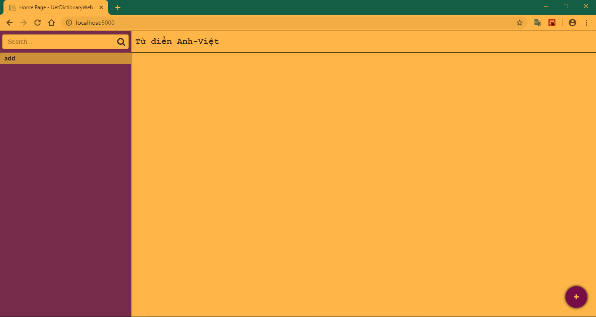
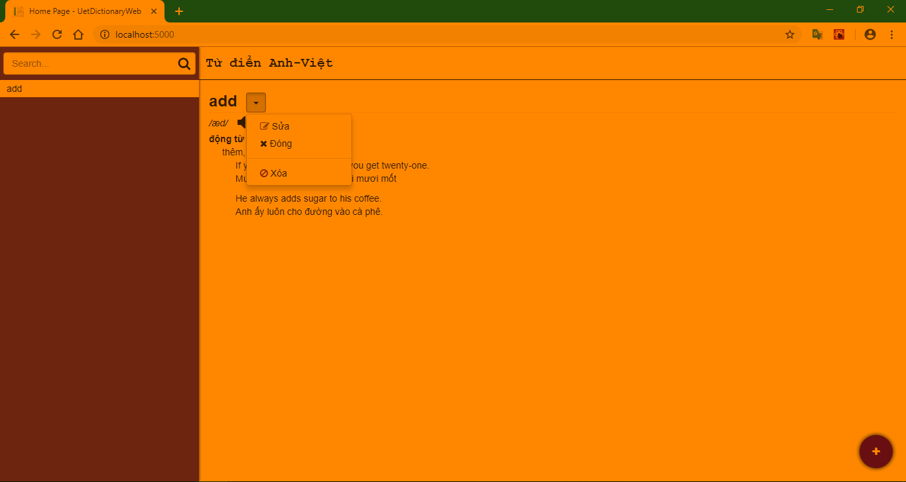
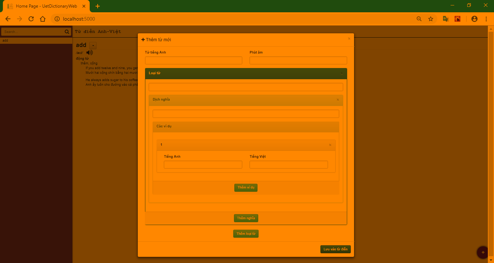

# Web

## Cài đặt

* Đọc những file này trước nhé [../../README.md](../../README.md), [../database.md](../database.md).

* Compile
```shell
# Di chuyển đến thư mục web
cd /path/to/repo/web
# Khởi tạo co sở dữ liệu
dotnet ef database update
# Compile ra bin/ và obj/
dotnet build
```
* Chạy ứng dụng
```shell
# di chuyển đến thư mục chứa project
dotnet run
```
* Sau đó mở trình duyệt, gõ đường dẫn như thông báo trong terminal, mà mặc định là [http://localhost:5000](http://localhost:5000)

## Giao diện đồ họa, hướng dẫn sử dụng



* Cột màu tím bên trái chứa thanh tìm kiếm và danh sách các từ có trong từ điển. Gõ vào thanh tìm kiếm sẽ lọc từ điển.
* Nút tròn có dấu cộng dùng để thêm từ mới, hay đúng hơn là nó sẽ mở modal box chứa form yêu cầu điền dữ liệu từ mới.



* Click vào từ ở cột bên trái để xem toàn bộ nội dung.
* Lúc này có thể xem nội dung, nghe phát âm, đóng nội dung, sửa hoặc xóa.



* Dựa vào cấu trúc bảng `Words` và cấu trúc **JSON** của cột `Content`, form điền dữ liệu sẽ trông như hình trên.

## Dành cho người muốn code

* Ứng dụng này chạy trên web, sử dụng template `mvc` và kết hợp với **Reactjs** (nhưng không phải template `react`). Bởi vì template `react` mà **.NET core** cung cấp mất quá nhiều thời gian để khởi động.
* Muốn build lại file **.js** thì cần cài các package sau:
```shell
# Di chuyển đến thư mục web/wwwroot
# bower
bower install bootstrap-css-only fontawesome snackbar
# npm
npm i --save-dev
# webpack
npm run build
```

* Phần Model của ứng dụng web tương tự như phần Model của ứng dụng trên Console nên mình sẽ chỉ mô tả phần Controller và View.
* Phần Controller chỉ chứa controller duy nhất là `HomeController` và các phương thức tương tác với Model.
* Phần View sử dụng **Reactjs**, bởi mình muốn làm một *single page application*. Views được chia làm các component, phần cấp như sau:
```xml
<App>
  <Layout>
    <Menu />
    <Content />
  </Layout>
  <InsertModal />
  <EditModal />
</App>
```
* `state` được quản lý bởi `class App`, "đổ xuống" các component con thông qua `props`. Cấu trúc của `state`:
```js
// value của các key trong object sau là mặc định
this.state = {
  data: [],
  searchInput: "",
  currentWord: {
    ID: 0,
    InEnglish: "",
    Pronunciation: "",
    Content: ""
  },
  insertModal: {
    show: false,
    data: {
      id: 0,
      inEnglish: { value: "", message: "" },
      pronunciation: { value: "", message: "" },
      content: [
        {
          type: { value: "", message: "" },
          meaningsAndExamples: [
            {
              meaning: { value: "", message: "" },
              examples: [
                {
                  inEnglish: { value: "", message: "" },
                  inVietnamese: { value: "", message: "" }
                }
              ]
            }
          ]
        }
      ]
    }
  },
  editModal: {
    show: false,
    data: {
      id: 0,
      inEnglish: { value: "", message: "" },
      pronunciation: { value: "", message: "" },
      content: [
        {
          type: { value: "", message: "" },
          meaningsAndExamples: [
            {
              meaning: { value: "", message: "" },
              examples: [
                {
                  inEnglish: { value: "", message: "" },
                  inVietnamese: { value: "", message: "" }
                }
              ]
            }
          ]
        }
      ]
    }
  }
};
```
* Khi nào thì những `state` này thay đổi (sắp xếp từ ít đến nhiều, đơn giản đến phức tạp):
    * `searchInput`: Đây là nội dung mà người dùng nhập vào thanh tìm kiếm, thay đổi dựa trên sự kiện `onChange` của thanh tìm kiếm.
    * `currentWord`: Dữ liệu của từ trong cơ sở dữ liệu. Thay đổi khi chọn từ trong từ điển. Khi `currentWord` thay đổi thì nội dung hiển thị (nghĩa, loại từ, ví dụ) cũng thay đổi theo.
    * `data`: Chứa toàn bộ nội dung của từ điển. Thay đổi khi sửa hoặc thêm từ mới. Cập nhật bằng `AJAX`, thông qua package `axios`.
    * `insertModal`: Chứa dữ liệu của form thêm từ mới khi thêm hoặc sửa. Thuộc tính `value` là nội dung của thẻ input, còn `message` là thông báo lỗi tương ứng. Giá trị của thuộc tính `value` và `message` thay đổi dựa trên sự kiện `onChange`.
    * `editModal`: Lưu nội dung của từ được chọn. Thay đổi khi chọn từ mới. Cấu trúc giống hệt `insertModal`.

